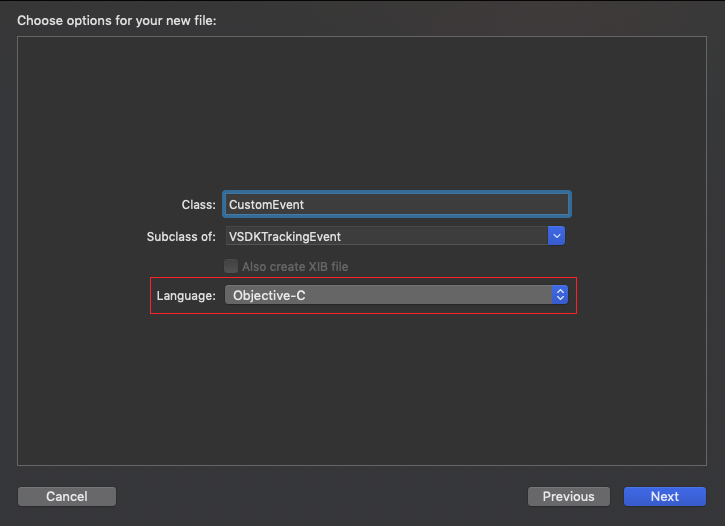
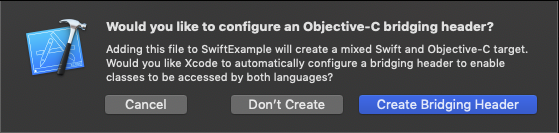
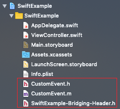

# Velocidi iOS SDK in Objective-C 


[](https://travis-ci.com/velocidi/velocidi-ios-objc-sdk)
[](https://codecov.io/gh/velocidi/velocidi-ios-objc-sdk)
[](https://github.com/Carthage/Carthage)

Velocidi's Objective-C SDK to integrate with iOS apps.

_SDK development in the early stages. Not ready for production. Use it at your own risk._

## Installation
### Installation with CocoaPods
To integrate VelocidiSDK into your Xcode project using CocoaPods, specify it in your `Podfile`:

```yaml
source 'https://github.com/CocoaPods/Specs.git'
platform :ios, '12.1'
project 'MyProject.xcodeproj'

target "MyProject" do
  pod 'VelocidiSDK', '~> 0.0.1'
end
```

Then, run:

```bash
$ pod install
```

### Installation with Carthage

To integrate VelocidiSDK into your Xcode project using CocoaPods, specify it in your `Cartfile`:

```
github "velocidi/velocidi-ios-objc-sdk" ~> 0.0.1
```

Then, run `carthage` to build the framework and drag the built VelocidiSDK.framework into your Xcode project.

## Requirements

VelocidiSDK should work with any version of iOS equal or bigger than 11.0.

## Usage

### Setup

Initialize the VelocidiSDK with the necessary `trackingHost` and the `matchHost` URLs. Without this, VelocidiSDK will not work. We suggest doing this when the application launches.

__Swift__
```swift
import VelocidiSDK

@UIApplicationMain
class AppDelegate: UIResponder, UIApplicationDelegate {

    var window: UIWindow?


    func application(_ application: UIApplication, didFinishLaunchingWithOptions launchOptions: [UIApplication.LaunchOptionsKey: Any]?) -> Bool {
        // Override point for customization after application launch.

        let config = VSDKConfig(hosts: "https://tr.yourdomain.com", "https://match.yourdomain.com")!
        VSDKVelocidi.start(config)
        return true
    }
```

__Objective-C__
```objc
@import VelocidiSDK;

@interface AppDelegate ()

@end

@implementation AppDelegate


- (BOOL)application:(UIApplication *)application didFinishLaunchingWithOptions:(NSDictionary *)launchOptions {
    // Override point for customization after application launch.
    
    VSDKConfig * config = [[VSDKConfig alloc] initWithHosts:@"https://tr.yourdomain.com": @"https://match.yourdomain.com"];
    [VSDKVelocidi start: config];
    return YES;
}
```

### Send a track event

In order to send a tracking event, create an instance of `VSDKTrackingEvent`. Then, call the singleton instance of `VSDKVelocidi` and use the `track` method.

__Swift__
```swift
import VelocidiSDK

...

let trackingEvent = VSDKPageView()
trackingEvent.siteId = "RandomSiteId"
trackingEvent.clientId = "RandomClientId"

VSDKVelocidi.sharedInstance().track(trackingEvent)
```

__Objective-C__
```objc
@import VelocidiSDK;

...

VSDKTrackingEvent * trackingEvent =  [[VSDKPageView alloc] init];
trackingEvent.clientId = @"RandomSiteId";
trackingEvent.siteId = @"RandomClientId";

[VSDKVelocidi.sharedInstance track: trackingEvent] 
```


You can also pass callback blocks that will be called when the request either succeeds or fails.

__Swift__
```swift
VSDKVelocidi.sharedInstance().track(trackingEvent, onSuccess:{ (response: URLResponse, responseObject: Any) in
  print("Success! Response: \(response)")
}, onFailure:{(error: Error) in
  print("Failed! Error: \(error.localizedDescription)")
})
```

__Objective-C__
```objc
[VSDKVelocidi.sharedInstance track: trackingEvent onSuccess: ^(NSURLResponse * response, id responseObject){
    NSLog(@"Success! Response: %@", trackingNumber);
} onFailure: ^(NSError * error){
    NSLog(@"Failed! Error: %@", [error localizedDescription]);
}];
```

#### Available tracking events model classes
* VSDKAddToCart
* VSDKPageView
* VSDKProductClick
* VSDKProductCustomization
* VSDKProductFeedback
* VSDKProductImpression
* VSDKProductView
* VSDKProductViewDetails
* VSDKPurchase
* VSDKRefund
* VSDKRemoveFromCart
* VSDKSearch
* VSDKSubscription

#### Create your custom tracking event
If none of the available tracking events matches your needs you can also extend `TrackingEvent` and create your own. 

__Beware!__ _Custom tracking events might not be interpreted by our services and will have limited functionality (logging and basic statistics). Please try to use one of the existing tracking events model classes or at least inherit from one of those classes when creating a custom event to ensure you make the most out of Velocidi's CDP._

##### Objective-C

Create a new Cocoa Touch class that inherits from `VSDKTrackingEvent` (or any of the other tracking event model classes).

Example:

__CustomEvent.h__
```objc
#import <VelocidiSDK/VelocidiSDK.h>

@interface CustomEvent : VSDKTrackingEvent

// Place below the desired fields you want to add to the tracking event
@property (nullable) NSString *customField;

@end
```

__CustomEvent.m__
```objc
#import "CustomEvent.h"

@implementation CustomEvent

- (instancetype) init {
    if(self = [super init]){
        self.type = @"customEvent"; // Only necessary when inheriting directly from VSDKTrackingEvent
    }
    return self;
}

@end
```

This new class can then be imported and used like any other tracking event:

```objc
#import "CustomEvent.h";

...

CustomEvent * trackingEvent =  [[CustomEvent alloc] init];
trackingEvent.clientId = @"RandomSiteId";
trackingEvent.siteId = @"RandomClientId";
trackingEvent.customField = @"RandomCustomField";

[VSDKVelocidi.sharedInstance track: trackingEvent] 
```

##### Swift
Due to limitations of the framework we use to serialize classes to JSON ([JSONModel](https://github.com/jsonmodel/jsonmodel)), a Swift class that inherits from `VSDKTrackingEvent` or any tracking event model class won't have its properties serialized when sending the event. To have this functionality you will have to create your custom event in Objective-C and import it into Swift:

1. Create a new Cocoa Touch class.
1. When prompted with the desired language, make sure to choose Objective-C. Press _Next_.



1. After creating the class you'll be asked if you want to configure an Objective-C bridging header. Press _Create Bridging Header_.



4. Three new files should have been created.



5. Import the created custom event class in the bridging header file (_AppName-Bridging-Header.h_):

```objc
//
//  Use this file to import your target's public headers that you would like to expose to Swift.
//

#import "CustomEvent.h"
```
6. Add the desired fields to the custom event (see Objective-C instructions for custom events)

1. Use the newly created class as any other tracking event model class:
```swift
let trackingEvent = CustomEvent()
trackingEvent.siteId = "RandomSiteId"
trackingEvent.clientId = "RandomClientId"
trackingEvent.customField = "RandomCustomField"
```

If you had any problem with importing the Objective-C class into Swift, please take a look at Apple's guide on [Importing Objective-C into Swift](https://developer.apple.com/documentation/swift/imported_c_and_objective-c_apis/importing_objective-c_into_swift).

### Make a match

You can match the user's Advertising Identifier with other known identifiers (like an internal ID) so that any event made by the user in the application can be traced back to a known user in the system.

__Swift__
```swift
@IBAction func sendMatchEvent(_ sender: Any) {
    let userId1 = VSDKUserId(userId: "bar", "fooType")
    let userId2 = VSDKUserId(userId: "baz", "fooType")
    let idsArray = NSMutableArray(array: [userId1, userId2])
      
    VSDKVelocidi.sharedInstance().match("1234-providerId-56789", userIds: idsArray, onSuccess:{ (response: URLResponse, responseObject: Any) in
        print("Success! Response: \(response)")
    }, onFailure:{(error: Error) in
        print("Failed! Error: \(error.localizedDescription)")
    })
}
```

__Objective-C__
```objc
- (IBAction)sendMatch:(id)sender {
    VSDKUserId * userId1 =  [[VSDKUserId alloc] initUserId:@"bar":@"foo"];
    VSDKUserId * userId2 =  [[VSDKUserId alloc] initUserId:@"baz":@"foo"];
    NSMutableArray * idsArray = [[NSMutableArray alloc] initWithObjects: userId1, userId2, nil];
    
    [VSDKVelocidi.sharedInstance match: @"1234-providerId-56789"
                               userIds: idsArray
                             onSuccess: ^(NSURLResponse * response, id responseObject){
        NSLog(@"Success! Response: %@", trackingNumber);
    } onFailure: ^(NSError * error){
        NSLog(@"Failed! Error: %@", [error localizedDescription]);
    }];
```
